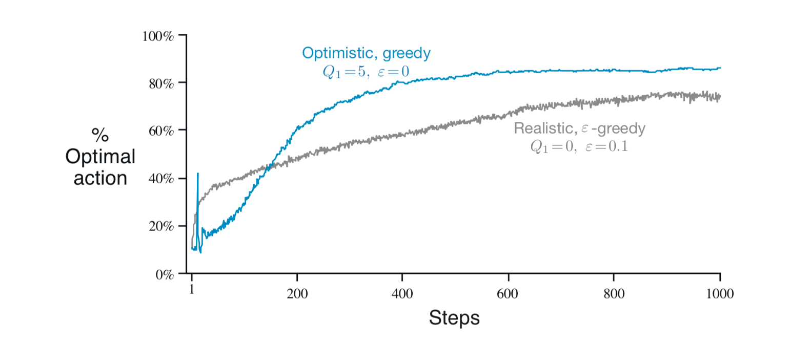
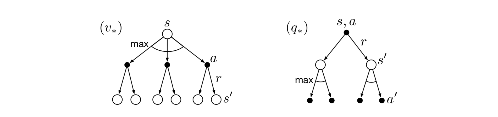

# 基础知识

## 定义

简单地说，强化学习指的是一个智能体学习如何判断在当前环境下应该采取什么动作，从而最大化奖励的过程。在学习的过程中，智能体并不会被告知应当采取什么行动，而要通过不断地尝试，来发现取得最大化收益的行动策略。

这一过程可以类比于人学习下五子棋的过程。在一开始，我们对规则都不是很熟悉，此时可能会直接让对手形成五连子，而并没有采取任何防御措施；通过这一负反馈，我们逐渐掌握了规则，知道了当对手即将形成活四的时候就应该防御；但是掌握规则并不会让我们能直接取胜，这就需要大量的对弈过程，在这一过程中发现不同的落子策略对于局势产生的影响；经过这样的大量训练，我们掌握了开局应该如何布阵、如何通过强迫对手走禁手来取胜这些比较高级的技巧。

监督学习与强化学习的不同之处在于，监督学习中的每个样本都可以理解为一个环境及其对应正确行为的组合，因此它没有强化学习中智能体与环境的交互过程；而非监督学习与强化学习的不同之处在于，非监督学习的目的仅仅是学习到数据中隐藏的模式，但是它没有最大化收益的过程。

## 基本要素

对于一个强化学习系统而言，它的四个基本要素包括：

- 策略：指的是智能体如何根据它当前所处的状态，来决定它应当采取的行动。
- 奖励信号：奖励信号决定了强化学习系统的学习目标。在智能体的每一次行动中，它都能收到一个奖励信号。智能体要学习如何在长期的交互过程中使得奖励最大化。
- 价值函数：价值函数指明了长期交互过程中的最优动作。一个状态的价值指的是，从当前状态开始，智能体在长期交互过程中可以取得回报的期望值。也就是说，奖励属于即时反馈，而价值则考虑了长期情形。
- 环境模型（可选）：环境模型用于模仿智能体与环境之间的交互过程。如果给定一个状态和行为，环境模型可以预测下一个可能的状态和对应的奖励。

## 分类

基于是否有环境模型，强化学习算法可分为基于模型（Model-based）的方法以及免模型（Model-free）的方法。基于模型的方法会构造一个环境模型，并以此进行规划；而免模型的方法则是通过试错法来进行学习。

基于如何选取下一步的动作，强化学习算法分为以策略为中心（Policy-based）和以价值为中心（Value-based）两大类。Policy-based方法直接输出下一步动作的概率，然后依据这些概率去随机选取动作；而Value-based方法则输出动作的价值，然后选择价值最高的动作，相当于间接优化策略。目前也出现了一些二者结合的方法，如Actor-critic。

基于价值或策略函数的更新频率，强化学习算法分为回合更新和单步更新两类方法。回合更新指的是智能体与环境的交互过程全部结束之后再进行更新；而单步更新指的是交互过程中的每一步都进行更新。

基于学习样本的来源，强化学习算法可分为在线学习（On-policy）和离线学习（Off-policy）两大类。在线学习指的是智能体必须自己参与其中来获取学习样本；而离线学习指的是智能体可以自己获取学习样本，也可以根据其它智能体的交互过程或是自己之前的交互过程来学习。

# 从多臂赌博机问题说起

## 简介

一个赌徒要去摇老虎机，走进赌场一看，一排老虎机，外表一模一样，但是每个老虎机吐钱的概率不一样。他不知道每个老虎机吐钱的概率分布是什么，那么每次该选择哪个老虎机可以做到最大化收益呢？这就是多臂赌博机问题（Multi-armed bandit problem, K-armed bandit problem）

K臂赌博机是一个简化版的强化学习问题，在这一任务中不涉及到任何环境的变化，而且每一次的行动没有任何关联性。因此，通过这一简单问题可以说明一些强化学习的基本算法。

K臂赌博机问题的数学描述为：在$k$臂赌博机问题中，$k$个动作各自对应于一个平均或者预期的回报值，通常将它们称为动作的价值。将时间步$t$采取的行动记作$A_t$，对应的回报记为$R_t$，那么对于任意一个动作$a$的价值$q_*(a)$就是回报的期望值，即：
$$
q_*(a)=E(R_t|A_t=a)
$$
如果我们知道每个动作的价值，那么$k$臂赌博机的问题就很容易解决，我们只需要选取价值最高的动作即可。但是实际中我们通常不知道价值的准确数值，只能通过实际获取的数据去估计。将$t$时刻对于动作$a$所对应价值的估计值记为$Q_t(a)$，我们的目标是希望$Q_t(a)$能够尽可能地接近$q_*(a)$。

## 利用与探索

在多次重复动作中，如果我们一直保持对价值的估计，那么在每个时间步都至少有一个估计价值最高的动作。在决定下一个行为时，如果选择估计价值最高的动作（即贪心行为），这样被称为是**利用**（exploitation）当前知识；而如果使用非贪心策略，选择估计价值不是最高的动作，这样被称为是**探索**（exploration），通过这种方式可以使得动作价值的估计更加准确，同时可能会发现某个动作具有更高的估计价值。

简单地说，对于一次动作来说，探索相当于是局部最优解；而从长期角度来说，对环境的探索可能会产生更大的综合收益。

因此，在强化学习任务中，如何平衡探索和利用是一个比较重要的问题。常用的动作选择策略包括：

1. $\epsilon$-greedy：以较小的概率$\epsilon$在所有的动作中随机选取，以$1-\epsilon$的概率选择价值最高的动作$A_t=\arg\max_a Q_t(a)$。当$\epsilon=0$是相当于是完全贪心的方法。
2. UCB（Upper Confidence Bound）：选择动作$A_t=\arg\max_a [Q_t(a)+c\sqrt{\frac{\ln t}{N_t(a)}}]$。其中$N_t(a)$代表$t$时刻之前动作$a$被选择的次数，参数$c$被用于控制探索的程度，$c$越高则越倾向于探索。在这一选择策略中，根号下的部分可以理解为$Q_t(a)$不确定性的一种衡量，也就是说探索的次数越少则不确定性越大。

在10臂赌博机试验上，这两种动作选择策略的表现如下图所示：

## 基于价值的方法

### 动作价值估计

对于动作价值一个简单的估计办法就是计算所有回报值的平均，即：
$$
Q_t(a)=\frac{\sum_{i=1}^{t-1}R_i\cdot 1_{A_i=a}}{\sum_{i=1}^{t-1}\cdot 1_{A_i=a}}
$$
当分母为0的时候，$Q_t(a)$会被初始化为某个默认值。随着样本数量的增多，$Q_t(a)$将会收敛于$q_*(a)$。

在实际计算时，通常我们不会保存每一个动作的所有回报，而是使用如下公式进行增量更新：
$$
\begin{aligned}
Q_{n+1}&=\frac{1}{n}\sum_{i=1}^{n} R_i \\
&=\frac{1}{n}\left( R_n+\sum_{i=1}^{n-1} R_i\right) \\
&=\frac{1}{n}\left( R_n+(n-1)\frac{1}{(n-1)}\sum_{i=1}^{n-1} R_i \right) \\
&=\frac{1}{n}\left( R_n+(n-1)Q_n \right) \\
&=Q_{n}+\frac{1}{n}(R_{n}-Q_{n}) \\
\end{aligned}
$$
上述公式适用于环境不变的强化学习问题。但是我们通常也会碰到一些环境随着时间变化的情形，对于这种情况我们便需要给近期的回报赋予一个较大的权重，而给之前较远时刻的回报赋予一个较小的权重，此时价值的增量更新可以写为：
$$
Q_{n+1}=Q_n+\alpha(R_n-Q_n)
$$
其中$\alpha\in (0,1]$。将公式中的$Q_n$一步步展开，上述公式等价于：
$$
\begin{aligned}
Q_{n+1}&=Q_n+\alpha(R_n-Q_n) \\
&=\alpha R_n +(1-\alpha)Q_n \\
&=\alpha R_n +(1-\alpha)(\alpha R_{n-1} +(1-\alpha)Q_{n-1}) \\
&=\alpha R_n + (1-\alpha)\alpha R_{n-1} + (1-\alpha)^2 Q_{n-1} \\
&=\cdots \\
&=(1-\alpha)^n Q_{1}+\sum_{i=1}^{n}\alpha (1-\alpha)^{n-i} R_i 
\end{aligned}
$$
也就是说，$Q_{n+1}$相当于是初始估计值$Q_1$和每一次回报$R_i$的加权平均。距离当前时刻越远的回报所占的权重也会相应地越来越低，且权重会呈指数趋势下降。

### 初始价值

从动作价值估计的公式中可以看出，如果使用固定系数$\alpha$的增量更新方式，初始价值$Q_1(a)$的选取会给$Q_n(a)$中加入偏差。即使在迭代过程中它的权重会逐渐降低，但是这一偏差无法被消除。

偏差所带来的作用具有两面性，一方面它相当于是增加了模型的参数；而另一方面，它又可以作为先验知识引入的一个方法。此外，一个较高的初始值设定也可以作为鼓励探索的一种方法。

以10臂赌博机实验为例，不同的初始价值选取对于算法影响如下图：

## 基于梯度的方法

### 原理

另一种方法是直接学习对每一个动作的偏好值$H_t(a)$，数值越大则越选择这一动作的概率越大。在得到偏好值之后，便可以根据Softmax函数来决定选取某个动作的概率：
$$
Pr\{A_t=a\}=\frac{\exp(H_t(a))}{\sum_{b=1}^{k}\exp(H_t(b))}=\pi_t(a)
$$
在下文中，我们使用$\pi_t(a)$来表示时刻$t$选取动作$a$的概率。在采取动作$A_t$并获得回报$R_t$之后，便可以使用梯度下降算法，来更新动作的偏好值：
$$
H_{t+1}(A_t)=H_t(A_t)+\alpha (R_t-\bar{R}_t)(1-\pi_t(A_t)) \\
H_{t+1}(a)=H_t(a)-\alpha (R_t-\bar{R}_t)\pi_t(a) ~~\forall a\ne A_t 
$$
其中$\alpha$代表步长，$\bar{R}_t$代表$0\sim t-1$时刻所有回报的平均值。也就是说，$\bar{R}_t$可以作为一个基准，如果采取动作$A_t$所取得的回报高于基准，则之后采取动作$A_t$的概率会提高；反之则概率会下降。

### 示例

下图为基于梯度方法在一个10臂赌博机模型上的实验结果，图中的Without Baseline指的是$\bar{R}_t=0$：

从中可以看出，加入Baseline会显著提高算法的表现。此外，较小的$\alpha$值等价于更加倾向多探索，因此最终表现也会提升。

# 马尔可夫决策过程

## 数学表述

强化学习可以被抽象为数学上的马尔可夫决策过程（Markov Decision Process，MDP）。MDP是一个形式化的连续决策过程的表述，在决策过程中，当前的行为不仅会影响到立即获取的回报，同时也会对之后的行为产生影响。一个马尔可夫决策过程可以表示为下图：

其中，智能体（Agent）会不断学习，并根据学习到的知识来进行决策。与智能体进行交互的部分被称为环境（Environment），在环境中的智能体会处于某个状态（State）。智能体和环境将持续地进行交互，智能体选择一个动作（Action），而环境则会根据所选取的动作给智能体一个回报（Reward），并对智能体的状态进行更新。智能体的目标是使得所有回报的累加值最大。

用数学语言表述为，智能体与环境会在每个离散的时间步长$t=0,1,2,3,\dots$进行交互。在每个时间步$t$，智能体会接收到环境给它的状态反馈$S_t\in \mathcal{S}$，并基于此选取一个动作$A_t\in \mathcal{A}(s)$。在一个时间步之后，智能体会收到一个回报值$R_{t+1}\in \mathcal{R} \sub \mathbb{R}$，并处于一个新的状态$S_{t+1}$中。因此，MDP将会产生一个如下的序列：
$$
S_0,A_0,R_1,S_1,A_1,R_2,S_2,A_2,R_3,\dots
$$
其中一些概念的详细解释如下：

- 智能体：指的是执行动作的主体，如自动驾驶应用中无人车就是智能体。
- 状态与状态空间：状态是对当前环境的一个概括，例如五子棋游戏中棋盘上所有棋子的状态。需要注意的是，状态必须能够概括完整的环境，例如LOL游戏中玩家屏幕上的画面就无法作为一个状态。状态空间指的是所有可能存在状态的集合，它可以是有限集合（如五子棋）也可以是无限集合（如LOL游戏）。
- 动作与动作空间：动作指的是做出的决策，例如棋类游戏中棋盘上有100个空位，那么动作便为在这100个空位的其中一个上面落子。动作空间指的是所有可能动作的集合，100个空位的棋盘所对应的动作空间大小便为100。
- 回报：在智能体执行一个动作之后，环境返回给智能体的一个数值。奖励往往由我们自己来定义，它定义的好坏非常影响强化学习的结果。不同动作回报值的设计应该是为了告诉智能体想要达到的目标，而不是想要实现目标的方法。例如五子棋游戏中，可以把形成五连珠的动作设置为1000，让对手形成五连珠的动作设置为-1000；而不是将防止对手形成五连珠的动作设置为1000。通过这样，智能体才能完成真正的目标。
- 环境：与智能体交互，并能够生成新状态的事物。例如棋类游戏中，环境相当于是游戏规则；无人驾驶应用中，真实的物理世界便为环境；等等。

在时刻$t$的交互过程中，它的状态转移只依赖于上一时刻的动作和状态，并不依赖于更早的动作和状态，那么便满足马尔可夫性。此时，下一时刻的状态以及对应的回报可以表示为如下的概率函数：
$$
p(s',r|s,a)=Pr\{S_t=s', R_t=r |S_{t-1}=s, A_{t-1}=a \}
$$
其中$s',s\in \mathcal{S}$，$r\in \mathcal{R}$，$a\in \mathcal{A}(s)$。函数$p$定义了MDP的动力学（dynamics）特性，它满足下面的性质：
$$
\sum_{s'\in \mathcal{S}}\sum_{r\in \mathcal{R}} p(s',r|s,a)=1 ~~~\text{or}~~~ \int_{s'\in \mathcal{S}}\int_{r\in \mathcal{R}} p(s',r|s,a)ds'dr=1
$$
通过这一四元的动力学函数，我们可以计算得到一些关于环境的信息（以离散情况为例）：

- 状态转移概率函数：$p(s'|s,a)=\sum_{r\in \mathcal{R}} p(s',r|s,a)$
- 下一状态未知时的期望回报：$r(s,a)=\sum_{r\in \mathcal{R}} r \sum_{s'\in \mathcal{S}} p(s',r|s,a)$
- 已知下一状态的期望回报：$r(s,a,s')=\sum_{r\in \mathcal{R}} r\frac{p(s',r|s,a)}{p(s'|s,a)}$

## 学习目标

上文中提到了强化学习非正式化描述的学习目标，即使得所有回报的累加值最大。它的正式化描述为，如果在$t$时刻之后所取得回报的序列为$R_{t+1},R_{t+2},\dots$，那么我们要最大化的就是下面的目标：
$$
G_t=R_{t+1}+R_{t+2}+\dots+R_T
$$
其中$T$代表最后一个时间步，对应于一个终止状态。例如五子棋游戏中自己或者对手形成五连珠的场景。

但是也存在一些强化学习的情景，并没有任何的终止状态，环境与智能体会一直进行交互。此时则需要让远期的回报按照指数规律衰减，否则累积回报便会趋于无穷大。也就是按照如下公式计算：
$$
G_t=R_{t+1}+\gamma R_{t+2}+\gamma^2 R_{t+3}+\dots=\sum_{k=0}^{\infty} \gamma^k R_{t+k+1}
$$
其中$\gamma \in [0,1]$代表衰减因子。

此外，上述两公式也可以改写为下面的递归形式：
$$
G_t=R_{t+1}+\gamma G_{t+1}
$$

## 策略和价值函数

智能体在选择动作时，需要依赖于一个策略函数或者价值函数。价值函数用于对智能体处在某个状态进行打分，或者是智能体在某个状态下采取某个行动进行打分。这里的分数高低代表了智能体在未来能够获得回报的期望值。相应地，价值函数的定义依赖于策略。策略指的是一个状态到每个动作选择概率的映射。如果智能体在$t$时刻采取策略$\pi$，那么$\pi(a|s)$就指的是在状态$S_t=s$下选择动作$A_t=a$的概率。

根据上面的描述，价值函数有两种定义方式：
$$
v_{\pi}(s)=E_{\pi}[G_t|S_t=s]=E_{\pi}[\sum_{k=0}^{\infty}\gamma^k R_{t+k+1}|S_t=s] \\
q_{\pi}(s,a)=E_{\pi}[G_t|S_t=s,A_t=a]=E_{\pi}[\sum_{k=0}^{\infty}\gamma^k R_{t+k+1}|S_t=s,A_t=a]
$$
$v_\pi$被称为策略$\pi$下的状态价值函数，$q_\pi$被称为策略$\pi$下的动作价值函数。

价值函数的一个重要特性是满足如下的递归关系：
$$
\begin{aligned}
v_\pi(s)=&E_\pi [G_t|S_t=s]\\
=&E_\pi [R_{t+1}+\gamma G_{t+1}|S_t=s]\\
=&\sum_{a}\pi(a|s)\sum_{s'}\sum_{r}p(s',r|s,a)[r+\gamma E_\pi [G_{t+1}|S_{t+1}=s']] \\
=&\sum_{a}\pi(a|s)\sum_{s'}\sum_{r}p(s',r|s,a)[r+\gamma v_\pi(s')] \\

q_\pi(s,a)=&E_\pi [G_t|S_t=s,A_t=a]\\
=&E_\pi [R_{t+1}+\gamma G_{t+1}|S_t=s,A_t=a]\\
=&\sum_{s'}\sum_{r}p(s',r|s,a)[r+\gamma E_\pi [G_{t+1}|S_{t+1}=s',A_t=a']] \\
=&\sum_{s'}\sum_{r}p(s',r|s,a)[r+\gamma \sum_{a'} \pi(a'|s')q_\pi(s',a')] \\
\end{aligned}
$$
这一公式也被称为$v_\pi$和$q_\pi$的贝尔曼方程（Bellman equation）。它表明了当前状态的价值和它之后状态的价值之间的关系，可以用下图表示：

## 最优策略和最优价值函数

强化学习的目标就是找到一个最优策略，使得长期回报最大。对于两个策略$\pi$和$\pi'$来说，如果对于所有的状态$s\in \mathcal{S}$，$v_\pi(s)\ge v_{\pi'}(s)$恒成立，那么就可以说$\pi' \ge \pi$，即策略$\pi'$优于$\pi$。基于这一定义，至少存在一个策略优于或者等于其它的所有策略，这一策略就被称为最优策略（Optimal Policy）。最优策略可能有多种，它们都被记为$\pi_*$。这些最优策略具有相同的最优状态价值函数和最优动作价值函数：
$$
\begin{aligned}
v_*(s)&=\max_{\pi}v_\pi(s) \\
q_*(s,a)&=\max_{\pi} q_\pi(s,a)
\end{aligned}
$$
对于$q_*(s,a)$来说，它相当于是在状态$s$执行动作$a$，并在之后遵循最优策略所取得的期望回报，因此$q_*(s,a)$和$v_*(s)$具有如下关系：
$$
q_*(s,a)=E[R_{t+1}+\gamma v_*(S_{t+1})|S_t=s,A_t=a]
$$
因为$v_∗$是最优价值函数，所以它的一致性条件可以写成特殊形式，而不参考任何特定的策略。这也被称为*贝尔曼最优方程*。直观上地，贝尔曼最优方程式表达了这样一个事实，即最优策略下的状态价值等于来自该状态的最佳行动的预期收益：
$$
\begin{aligned}
v_*(s)=& \max_{a} q_{\pi_*}(s,a) \\
=& \max_{a} E_{\pi_*}[G_t|S_t=s,A_t=a] \\
=& \max_{a} E_{\pi_*}[R_{t+1}+\gamma G_{t+1}|S_t=s,A_t=a] \\
=& \max_{a} E_{\pi_*}[R_{t+1}+\gamma v_*(S_{t+1})|S_t=s,A_t=a] \\
=& \max_{a} \sum_{s',r}p(s',r|s,a)[r+\gamma v_*(s')] \\
\end{aligned}
$$
$q_*(s,a)$也可以表示为如下的贝尔曼最优方程：
$$
\begin{aligned}
q_*(s,a)=& E[R_{t+1}+\gamma \sum_{a'}q_*(S_{t+1,a'})|S_t=s,A_t=a] \\
=& \sum_{s',r}p(s',r|s,a)[r+\gamma \max_{a'} q_*(s',a')]
\end{aligned}
$$
二者的计算过程可以表示为下图：

一旦有了$v_*$，就可以较容易地确定最优策略。对于每个状态，只需要选取可以取得最大$v_*$值的动作即可，也就是贪婪的选择策略。由于$v_*$的计算过程已经考虑了长期的收益，因此贪心策略在长期来看也可以取得最优结果。如果有$q_*$，那么对于任何状态$s$，智能体甚至不需要做前向搜索，因为$q_*$中已经包含了前向搜索的结果。

虽然我们已经定义了最优价值函数和最优策略。但在实践中，却需要以极高的计算成本才能生成最优策略，也常常会受到内存资源的限制。因此，需要通常需要使用一些近似方法来代替。

# 动态规划

## 概述

动态规划指的是在给定一个环境的完美模型之后，将其看作是一个马尔可夫决策过程，以此去计算最优策略的一系列算法。由于动态规划算法要求完美模型假设以及需要耗费大量的计算资源，因此目前被使用的较少，但是仍有重要的理论价值。它的基本思想是使用价值函数去组织和规划最优策略的搜索过程。

## 策略迭代

### 策略评估

针对于任意的策略$\pi$，我们需要评估它的状态价值函数$v_{\pi}$。根据贝尔曼方程，有：
$$
v_\pi(s)=\sum_{a}\pi(a|s)\sum_{s'}\sum_{r}p(s',r|s,a)[r+\gamma v_\pi(s')] \\
$$
如果其中的$\gamma<1$，或者在策略$\pi$下能够保证所有的状态最终都可以终止，那么$v_\pi$的值存在且唯一。当环境的动力学特性完全已知时，上式就相当于是$|\mathcal{S}|$个未知数（即$v_\pi(s)$）组成的$|\mathcal{S}|$个线性方程组。因此我们可以去直接求解，但是这样的计算效率太低。

另一种办法是使用迭代求解的办法。以任意的方式构造初始状态$v_0$（除了终止状态之外），之后对于每一个状态$s\in \mathcal{S}$，都用如下的贝尔曼方程进行迭代更新：
$$
v_{k+1}(s)=\sum_{a}\pi(a|s)\sum_{s'}\sum_{r}p(s',r|s,a)[r+\gamma v_k(s')] \\
$$
$v_k=v_\pi$是方程组迭代更新的收敛点，因为$v_\pi$的贝尔曼方程能够满足方程组的等式关系。这一算法被叫做迭代策略评估（iterative policy evaluation）。在迭代过程中，对于每一个状态$s$，都使用它后续状态$s'$的旧价值以及期望回报，去计算$s$的新价值，这样的更新操作被称为期望更新（expected update）。

在实际编程中，根据上述等式则需要使用两个数组，分别保存$v_k$和$v_{k+1}$的值。为了节省内存，也可以使用就地的更新策略，在计算得到更新值之后直接替换掉旧值；而在之后的计算过程中，也直接使用更新后的值（类似于方程组迭代法求解的高斯-赛德尔迭代和简单迭代），这种方法会收敛地更快。

### 策略改进

对策略进行评估的目的是为了进一步找到更好的策略。我们首先考虑如下的简单情形：在状态$s$下采取某一动作$a$，并在之后继续使用策略$\pi$。根据贝尔曼方程，那么对应的价值$q_\pi(s,a)$为：
$$
q_\pi(s,a)=\sum_{s'}\sum_{r}p(s',r|s,a)[r+\gamma v_\pi(s')] \\
$$
对于上述策略改进的判断准则是上式的结果与$v_\pi(s)$的大小关系。如果$q_\pi(s,a)$的值更大，那么在状态$s$时选择动作$a$并在之后继续沿用策略$\pi$的方法，比起一直采取策略$\pi$的方法更好。

这一准则也可以写为更通用的策略提升定理（Policy improvement theorem），对于两个确定性的策略$\pi$和$\pi'$，如果对于所有的状态$s\in \mathcal{S}$，满足如下关系
$$
q_\pi(s,\pi'(s)) \ge v_\pi(s)
$$
那么策略$\pi'$一定好于$\pi$，或者至少与$\pi$一样好。也就是说如下的关系式一定成立
$$
v_{\pi'}(s)\ge v_{\pi}(s)
$$
证明过程如下：
$$
\begin{aligned}
v_\pi(s) \le & q_\pi(s,\pi'(s)) \\
=& E[R_{t+1}+\gamma v_\pi(S_{t+1})|S_t=s, A_t=\pi'(s)] \\
=& E_{\pi'}[R_{t+1}+\gamma v_\pi(S_{t+1})|S_t=s] \\
\le&  E_{\pi'}[R_{t+1}+\gamma q_\pi(S_{t+1},\pi'(S_{t+1}))|S_t=s] \\
=& E_{\pi'}[R_{t+1}+\gamma E[R_{t+2}+\gamma v_\pi(S_{t+2})|S_{t+1}=s, A_{t+1}=\pi'(s)]|S_t=s] \\
=& E_{\pi'}[R_{t+1}+\gamma R_{t+2}+\gamma^2 v_\pi(S_{t+2})|S_t=s] \\
&\vdots \\
\le& E_{\pi'}[R_{t+1}+\gamma R_{t+2}+\gamma^2 R_{t+3}+\dots|S_t=s] \\
=& v_{\pi'}(s)
\end{aligned}
$$
基于此，我们很自然想到可以在每个状态都选择$q_\pi(s,a)$最大的动作。也就是说，以如下的贪心策略$\pi'$选择行动：
$$
\pi'(s)=\arg\max_a q_\pi(s,a)=\arg\max_a \sum_{s',r}P(s',r|s,a)[r+\gamma v_\pi(s')]
$$
贪心策略可以满足策略提升定理的条件，因此可以确定它至少与之前的策略一样好。因此，以原始策略所计算出的价值函数作为基础，采取贪心策略选择每个状态的动作，从而得到一组新的策略，这被称为策略提升（Policy improvement）。

我们假设新的贪心策略$\pi'$与旧策略$\pi$一样好，但是没有胜过旧策略，那么就有$v_{\pi'}=v_\pi$，而且对于所有的状态$s\in \mathcal{S}$都满足：
$$
v_{\pi'}(s)=\max_a E[R_{t+1}+\gamma v_{\pi'}(S_{t+1})| S_t=s,A_t=a]= \max_a \sum_{s',r}p(s',r|s,a)[r+\gamma v_{\pi'}(s)]
$$
这一表达式与贝尔曼最优方程的形式相同。这也就是说，$v_{\pi'}=v_*$，而且$\pi'$和$\pi$都是最优策略。因此，策略提升能够给出一个严格意义上的更好策略，除非原始策略已经是最优策略。

### 策略迭代

当我们通过使用$v_\pi$获得了更好的策略$\pi'$之后，就可以进一步计算$v_{\pi'}$，并基于此得到一个第二次改进的策略$\pi''$。如此重复进行，便可以使得策略一直被改进，并最终得到最优策略$\pi_*$。这一过程被称为策略迭代（Policy iteration），可以表示如下：
$$
\pi_0 \rightarrow v_{\pi_0} \rightarrow \pi_1 \rightarrow v_{\pi_1} \rightarrow \cdots \rightarrow \pi_* \rightarrow v_{*}
$$
其中，由$\pi_i$得到$v_{\pi_i}$的过程被称为评价，由$v_{\pi_i}$得到$\pi_{i+1}$的过程被称为提升。其中每次策略提升都可以严格保证好于之前的策略，除非已经获得了最优策略。由于一个有限MDP的策略也是有限的，因此通过有限次数的迭代，一定可以收敛得到一个最优策略和最优的价值函数。

### 广义策略迭代

广义策略迭代（Generalized Policy Iteration）指的是策略评估和策略提升两个过程交互的一般概念，而不依赖于两个过程的粒度和其他细节。几乎所有的强化学习方法都可以被描述为GPI，也就是说，这些方法都有可识别的策略和价值函数，策略总是依据价值函数进行更新，而价值函数则依赖于策略来计算。 

如果评估过程和提升过程都不再发生较大的变化，那么价值函数和策略一定是最优的。价值函数仅在与当前策略一致时才稳定，同时策略也仅在相对于当前价值函数为贪婪策略时才稳定。因此，只有当一个策略在它相应的价值函数下为贪婪策略时，两个过程才能都稳定下来。这预示着贝尔曼最优方程成立，此时这个策略和价值函数是最优的。

GPI中的评估和提升的过程既存在竞争又存在合作。在竞争这个意义上，二者走向相反的方向：按照当前的价值函数选择贪婪策略通常会使得价值函数相对于新的策略出现偏差，而使价值函数与策略一致通常会导致该策略不再贪婪。 然而，从长远来看，这两个过程相互作用可以找到单一的联合解：最优价值函数和最优策略。

## 价值迭代

策略迭代的一个缺点是每个迭代步骤都包括一次策略评估，而策略评估这一过程本身就是一个漫长的迭代计算过程，需要对整个状态集合多次扫描。实际上，策略评估的过程可以通过多种办法被截断，与此同时不会丢掉策略迭代的收敛性。

一种特殊的情形是策略评估过程在一次扫描之后就停止，即每个状态只更新一次。这种算法被称为价值迭代（value iteration）。它的更新函数可以被表示为策略提升与截断的策略评估的组合形式：
$$
v_{k+1}(s)=\max_a E[R_{t+1}+\gamma v_k(S_{t+1})|S_t=s,A_t=a]=\max_a \sum_{s',r}p(s',r|s,a)[r+\gamma v_k(s')]
$$
对于任意的$v_0$，在$v_*$存在的情况下，序列$\{v_k\}$一定可以收敛于$v_*$。该式的另一种理解是参考贝尔曼最优价值函数，这一价值迭代的表达式其实相当于是将贝尔曼最优方程改写为了更新规则。

与策略评估类似，价值迭代过程也需要重复迭代计算。在实际使用中，当某一次迭代之后价值函数的变化值小于设定的阈值，便可以停止迭代。

## 异步更新

上述介绍的动态规划算法需要对MDP中的每一个状态进行扫描，如果状态集合很大，那么全局扫描的操作显然不现实。异步的动态规划算法不会对状态集合做全局扫描，相反，它会按照任意顺序，并使用当前存储的价值，对某个状态的价值进行更新。为了能够正确地收敛，需要持续地对所有的状态进行更新，不能在某个时间之后停止对某些状态的更新。

异步的动态规划算法具有充分的灵活性，在智能体与环境的实时交互过程中可以同时进行价值与策略的更新，但是需要注意的一点是它并不能降低计算量。

# 蒙特卡洛法

## 概述

蒙特卡洛法不要求了解完整的环境信息，它的学习方法是从智能体与环境交互所产生的$\{\text{状态、动作、回报}\}$序列中学习。这种学习方式不需要了解环境的动力学信息，就可以获得最优的策略。

## 在线法

### 概述

在线法指的是智能体基于当前策略去采取动作，并根据由此产生的序列来对当前策略进行评估和改进。但是为了让智能体在策略迭代提升的过程中能够充分地进行探索，有时无法得到最优策略，而是得到一个保证智能体能够进行探索的次优策略。

### 价值估计

#### 状态价值估计

状态价值估计指的是根据智能体按照策略$\pi$与环境进行交互而产生的$\{\text{状态、动作、回报}\}$的序列，来估计序列中所包含的状态$s$的价值$v_{\pi}(s)$。在这个序列中每一次出现$s$都被称为是$s$的一次访问。当然，在一组序列中$s$可以多次出现。

蒙特卡洛法的一个重要假设是，对于每个状态所对应价值的预测是独立的，不需要依赖于其它状态的价值估计，这与动态规划算法是一样的。

依据估计$v_{\pi}(s)$方法的不同，状态估计方法可以分为两种。第一种被称为第一次访问的蒙特卡洛法（First-visit MC Method），它指的是仅使用所有序列中第一次访问状态$s$时所对应累积回报的平均值来估计$v_{\pi}(s)$；而第二种被称为每次访问的蒙特卡洛法（Every-visit MC Method），它指的是从每次访问状态$s$所对应累积回报的平均值来估计$v_{\pi}(s)$。

对于第一次访问的蒙特卡洛法，它的算法步骤如下：

对于每次访问的蒙特卡洛法，则省略掉检查$S_t$是否在序列的更早期出现过即可。

根据大数定律，随着产生的序列数量越来越多，$v_{\pi}(s)$的估计值会越来越接近于期望值。

#### 动作价值估计

如果有一个环境的模型，那么通过状态的价值可以容易地得到一个策略。但如果没有模型，那么更加有用的方法是估计动作（即（状态，动作）二元组）的价值，即预测$q_{\pi}(s,a)$的值。

与使用蒙特卡洛方法进行状态值估计类似，要估计动作价值只需要将状态改为（状态，动作）二元组即可。如果在一个序列中，在状态$s$之后采取了动作$a$，那么就代表（状态，动作）二元组$(s,a)$被访问过一次。

动作价值估计的复杂之处在于，许多（状态，动作）二元组可能从来未被访问过。如果$\pi$是一个确定的策略，那么每个状态就只对应于一个动作，这样便无法产生准确的价值估计。因此必须确保探索过程是在持续进行的，有一些办法可以满足这一要求。

一个方法是指定序列的开端为（状态，动作）二元组，并且每个二元组都有一定概率被选择到。这使得迭代次数无限大时，每个（状态，动作）二元组都能被选择到。这也被称为起始探索（Exploring starts）假设。但是当学习过程是从真实环境中学习时，这一策略可能并不适用。

另一种策略是使用随机策略，就是在每个状态下可以选择的所有动作都有大于0的概率被选择到。这样在长期的迭代过程中也可以保证每个（状态，动作）二元组都能被选择到。

### 策略提升

#### 在线法

##### 起始探索法

在使用蒙特卡洛法获得价值估计之后，接下来可以用这些估计值来优化策略。与动态规划法类似，同样可以采用策略迭代的方法来得到最优策略，大致过程如下：
$$
\pi_0\rightarrow q_{\pi_0}\rightarrow \pi_1\rightarrow q_{\pi_1}\rightarrow \cdots \rightarrow \pi_*\rightarrow q_{*}
$$
由$\pi$得到$q_\pi$的过程为策略估计，按照上文蒙特卡洛预测的方法进行即可；而由$q_\pi$得到$\pi$的过程称为策略提升，此时只需要按照价值的估计值贪心地选择价值最大的策略即可。

使用起始探索的方法获得最优策略的方法如下：

##### 软策略迭代法

但是有时我们无法使用起始探索方法，此时仍然要保证所有的动作都能被选择到。为了确保这一条件，另一种方法是使用软策略，也就是说在迭代初期需要保证对于所有的状态$s$和动作$a$，$\pi(a|s)>0$，然后随着迭代过程的进行逐渐切换为确定性策略。例如$\epsilon$-greedy策略便满足这一要求，使用$\epsilon$-greedy策略进行迭代的算法步骤如下：

可以证明，按照$\epsilon$-greedy策略对原始策略进行更新之后，得到的是原始策略的提升：
$$
\begin{aligned}
q'(s,\pi'(s))=&\sum_{a} \pi'(a|s)q_\pi(s,a) \\
=&\frac{\epsilon}{|\mathcal{A(s)}|}\sum_{a}q_\pi(s,a)+(1-\epsilon)\max_a q_\pi(s,a) \\
\ge& \frac{\epsilon}{|\mathcal{A(s)}|}\sum_{a}q_\pi(s,a)+(1-\epsilon)\sum_{a}\frac{\pi(a|s)-\frac{\epsilon}{|\mathcal{A(s)}|}}{1-\epsilon}q_\pi(s,a)~~ \left(\sum_{a}\frac{\pi(a|s)-\frac{\epsilon}{|\mathcal{A(s)}|}}{1-\epsilon}=1 \right)\\
=&v_\pi(s)
\end{aligned}
$$

## 离线法

### 概述

离线法的思路是使用两个不同的策略，一个策略更加倾向于在环境中探索，被称为行为策略（Behavior policy）；而另一个策略则是通过学习得到的最优策略，被称为目标策略（Target policy）。在这种学习方式中，数据不是通过最终的最优策略产生的，因此整个过程也被称为离线策略学习（Off-policy Learning）。

相比于在线策略，离线策略通常更难收敛。但是离线策略的适用范围更广，它可以从传统的非学习型控制器或是人类专家产生的数据中学习。

### 策略估计

离线策略学习下的策略估计问题指的是，给定策略$b$以及依照它产生的一系列动作序列，来估计目标策略$\pi$的状态价值$v_\pi$或者动作价值$q_\pi$。为了能保证策略估计的顺利进行，要求$\pi(a|s)>0$时，$b(a|s)>0$同样成立。

几乎所有的离线策略方法都依赖于重要性采样（Importance Sampling）技术，这一技术通过某一概率分布的样本去预测另一个概率分布的期望值。在离线策略学习中，需要通过重要性采样比（Importance-sampling Ratio）来对返回值进行加权。这一比值是通过状态-动作序列在两种策略下出现的概率之比来计算的。

具体来说，给定一个起始状态$S_t$，在策略$\pi$下产生状态-动作序列$A_t,S_{t+1},A_{t+1},\dots,S_T$的概率为：
$$
\begin{aligned}
&\text{Pr}\{A_t,S_{t+1},A_{t+1},\dots,S_T|S_t,A_{t:T-1} \sim \pi\}\\
=& \pi(A_t|S_t)p(S_{t+1}|S_t,A_t)\pi(A_{t+1}|S_{t+1})\cdots p(S_{T}|S_{T-1},A_{T-1}) \\
=& \Pi_{k=t}^{T-1} \pi(A_k|S_k)p(S_{k+1}|S_k,A_k)
\end{aligned}
$$
由此可以计算在策略$\pi$和$b$下产生状态-动作序列$A_t,S_{t+1},A_{t+1},\dots,S_T$的概率之比（即重要性采样比）$\rho_{t:T-1}$为：
$$
\rho_{t:T-1}=\frac{\Pi_{k=t}^{T-1} \pi(A_k|S_k)p(S_{k+1}|S_k,A_k)}{\Pi_{k=t}^{T-1} b(A_k|S_k)p(S_{k+1}|S_k,A_k)} =\frac{\Pi_{k=t}^{T-1} \pi(A_k|S_k)}{\Pi_{k=t}^{T-1} b(A_k|S_k)}
$$
也就是说，重要性采样比的计算仅仅依赖于两种策略以及产生的序列。

在得到重要性采样比$\rho_{t:T-1}$之后，我们便可以计算策略$\pi$下的价值函数：
$$
E[\rho_{t:T-1}G_t|S_t=s]=v_\pi(s)
$$
其中$G_t$代表累计回报。

对于每次访问的蒙特卡洛法，定义$\mathcal{J}(s)$代表状态$s$被访问的所有时间步所组成的集合；对于第一次访问的蒙特卡洛法，$\mathcal{J}(s)$代表每个序列中状态$s$被第一次访问的时间步所组成的集合。$v_\pi(s)$的值可以通过简单重要性采样来计算：
$$
V(s)=\frac{1}{|\mathcal{J}(s)|}\sum_{t\in \mathcal{J}(s)} \rho_{t:T(t)-1}G_t
$$
或者是使用加权重要性采样计算：
$$
V(s)=\frac{\sum_{t\in \mathcal{J}(s)} \rho_{t:T(t)-1}G_t}{\sum_{t\in \mathcal{J}(s)} \rho_{t:T(t)-1}}
$$
在实际中，通常采用增量实现的方式来进行计算。以动作价值估计为例，算法步骤如下，状态价值估计的算法步骤与之类似：

### 策略提升

在使用离线策略进行价值的估计之后，就可以使用贪心算法对策略进行更新。算法步骤如下：

这种迭代方法的一个潜在问题是，仅当一个序列尾端的所有动作都符合贪心策略时，模型才会从中学习。因此，如果非贪婪动作较多，那么学习过程将会很慢，尤其是当一个状态出现在一个长序列的开端时。

# 时间差分法

## 概述

时间差分法是蒙特卡洛思想和动态规划思想的融合，它可以像蒙特卡洛法一样直接从样本中学习，同时像动态规划算法一样根据使用其它的估计价值对自身进行更新。

相比于动态规划算法来说，时间差分算法不需要环境的模型；相比于蒙特卡洛方法来说，时间差分算法很自然地以在线和完全增量的方式来实现。假设迭代过程中的学习率被设置地足够小，那么时间差分算法理论上也可以保证收敛。

## 时间差分预测

时间差分算法和蒙特卡洛算法都是直接使用样本来解决预测问题。对于每次访问的蒙特卡洛算法，在非固定环境中的价值更新函数可以写为：
$$
V(S_t)\leftarrow V(S_t)+\alpha[G_t-V(S_t)]
$$
其中，$G_t$代表$t$时刻之后的累积回报，$\alpha$是一个常数。蒙特卡洛算法必须等待一个状态序列完全结束，能够计算出$G_t$的值之后，才对价值进行更新。

而对于时间差分方法来说，它仅需要等到下一个时间步就可以进行更新，即根据$t+1$的回报和价值估计，对$t$时刻的状态进行更新。对于最简单的时间差分算法，它的更新函数为：
$$
V(S_t)\leftarrow V(S_t)+\alpha[R_{t+1}+\gamma V(S_{t+1})-V(S_t)]
$$
这种方法也被称为$TD(0)$，或者是一步时间差分。它是$TD(\lambda)$和$n$步时间差分法的简化版。

$TD(0)$算法的详细步骤如下：

$\delta_t= R_{t+1}+\gamma V(S_{t+1})-V(S_t)$通常也被称为时间差分误差。对于蒙特卡洛方法而言，它可以看作是时间差分误差之和，即$G_t-V(S_t)=\sum_{k=t}^{T-1}\gamma^{k-t}\delta_k$。

## 策略控制

### 在线法：Sarsa

Sarsa是一种在线的策略更新算法。它使用时间差分法对动作价值$q_\pi(s,a)$进行估计，并基于此对策略进行更新。对于一个状态-动作-回报序列$S_t,A_t,R_{t+1},S_{t+1},A_{t+1},\dots$，Sarsa使用如下公式更新非终止状态的动作价值$q_\pi(s,a)$：
$$
Q(S_t,A_t)\leftarrow Q(S_t,A_t)+\alpha[R_{t+1}+\gamma Q(S_{t+1},A_{t+1})-Q(S_t,A_t)]
$$
而对于终止状态，$q_\pi(s,a)=0$。也就是说，每个五元组$(S_t,A_t,R_{t+1},S_{t+1},A_{t+1})$都对应于一次动作价值的更新，这也是Sarsa名字的来源。

在得到动作价值的估计之后，便可以基于这一组估计值对策略进行修改。经过多次迭代便可以得到最优策略。算法步骤如下：

### 离线法：Expected Sarsa

对Sarsa的一种改进方法被称为Expected Sarsa，它的更新公式为：
$$
Q(S_t,A_t)\leftarrow Q(S_t,A_t)+\alpha[R_{t+1}+\gamma \sum_{a}\pi(a|S_{t+1}) Q(S_{t+1},a)-Q(S_t,A_t)]
$$
虽然这种方法在计算上更加复杂，但是相比于普通的Sarsa，它消除了在线方法中$A_{t+1}$的随机性所带来的方差。因此Expected Sarsa相比于普通的Sarsa有着更好的表现。

### 离线法：Q-learning

Q-learning是一种离线的策略更新方法，它同样使用时间差分法对动作价值进行更新，但是更新方法略有不同：
$$
Q(S_t,A_t)\leftarrow Q(S_t,A_t)+\alpha[R_{t+1}+\gamma \max_{a}Q(S_{t+1},a)-Q(S_t,A_t)]
$$
此时，所学习到的动作价值函数$q$会直接近似于$q_*$，而与产生状态-动作-价值序列所使用的策略无关。

这一算法步骤如下：

## 最大化偏差

Q-learning中的最大化操作可能会导致最大化偏差（Maximization Bias）的出现，这是因为使用一组数据同时完成价值估计和决定最优动作两个任务。因此，如果价值估计和决定最优动作分别使用来自于两组序列的数据，便可以一定程度上避免这个问题。例如Double Q-learning便使用这一方法对动作价值进行更新：
$$
Q_1(S_t,A_t)\leftarrow Q_1(S_t,A_t)+\alpha[R_{t+1}+\gamma Q_2(S_{t+1},\arg\max_a Q_1(S_{t+1},a))-Q_1(S_t,A_t)]
$$
使用Double Q-learning进行价值估计的步骤如下：

类似地，对于Expected Sarsa也有相应的Double Expected Sarsa算法。

# $n$步采样法

## 概述

$n$步采样法（n-step Bootstrapping）是一种介于时间差分法（即TD（0））和蒙特卡洛法之间的方法，它允许对任意的时间步长进行采样。因此也称为n步时间差分算法。它们的区别可以表示为下图：

## n步时间差分预测

对于状态-动作-回报序列$S_t,A_t,R_{t+1},S_{t+1},A_{t+1},\dots, S_{T-1},A_{T-1},R_{T},S_{T}$，它的$n$步回报可以使用如下公式计算：
$$
G_{t:t+n}=R_{t+1}+\gamma R_{t+2}+\cdots+\gamma^{n-1} R_{t+n}+\gamma^n V_{t+n-1}(S_{t+n})
$$
其中$n\ge 1$，$0\le t< T-n$。基于$n$步回报的n步时间差分公式如下：
$$
V_{t+n}(S_t)=V_{t+n-1}(S_t)+\alpha[G_{t:t+n}-V_{t+n-1}(S_t)]
$$

通过n步时间差分来估计状态价值的算法如下：

## 策略控制

### n步Sarsa

在n步Sarsa中，动作价值更新的公式为：
$$
Q_{t+n}(S_t,A_t)=Q_{t+n-1}(S_t,A_t)+\alpha[G_{t:t+n}-Q_{t+n-1}(S_t,A_t)]
$$
其中，
$$
G_{t:t+n}=R_{t+1}+\gamma R_{t+2}+\cdots+\gamma^{n-1} R_{t+n}+\gamma^n Q_{t+n-1}(S_{t+n},A_{t+n})
$$

基于上述公式，可以得到迭代更新策略的算法流程：

对于Expected Sarsa，只需要将计算$G_{t:t+n}$的公式修改为：
$$
G_{t:t+n}=R_{t+1}+\gamma R_{t+2}+\cdots+\gamma^{n-1} R_{t+n}+\gamma^n \bar{V}_{t+n-1}(S_{t+n})
$$
其中，
$$
\bar{V}_{t}(s)=\sum_{a}\pi(a|s)Q_t(s,a)
$$

### n步离线学习

使用离线学习的方法对状态价值的更新公式如下：
$$
V_{t+n}(S_t)=V_{t+n-1}(S_t)+\alpha \rho_{t:t+n-1}[G_{t:t+n}-V_{t+n-1}(S_t)]
$$
如果使用动作价值，也就是离线版的n步Sarsa，则更新公式为：
$$
Q_{t+n}(S_t,A_t)=Q_{t+n-1}(S_t,A_t)+\alpha \rho_{t+1:t+n-1}[G_{t:t+n}-Q_{t+n-1}(S_t,A_t)]
$$
其中，$\rho_{t:h}$被称为重要性采样比，它的计算公式如下：
$$
\rho_{t:h}=\prod _{k=t}^{\min_{h,T-1}} \frac{\pi(A_k|S_k)}{b(A_k|S_k)}
$$
使用离线的n步Sarsa进行策略迭代的算法如下：

### n步tree-backup

tree-backup属于不带有重要性采样的离线算法，它在计算$G_{t:t+n}$时使用的是类似于expected Sarsa计算动作价值期望值的方式：
$$
G_{t:t+n}=R_{t+1}+\gamma \sum_{a\ne A_{t+1}}\pi(a|S_{t+1})Q_{t+n-1}(S_{t+1},a)+\gamma \pi(A_{t+1}|S_{t+1})G_{t+1:t+n}
$$
动作价值的更新方式与n-step Sarsa相同：
$$
Q_{t+n}(S_t,A_t)=Q_{t+n-1}(S_t,A_t)+\alpha [G_{t:t+n}-Q_{t+n-1}(S_t,A_t)]
$$
使用Tree-backup方式迭代获得最优策略的算法步骤如下：

# 表格法中的规划和学习

## 模型和规划

给定一个状态和动作，一个环境的模型可以用来预测真实环境将会如何对动作进行响应。模型分为分布模型（Distribution Models）和采样模型（Sample Models），分布模型能够给出所有的可能性及其对应概率，而采样模型则是根据概率分布进行采样，只能得到所有可能性中的其中一个。通过使用模型，我们便可以产生模拟的经验，它们可以被用来训练模型。

而规划（Planning）指的是以一个模型为输入，然后基于这个模型得到一个策略。规划分为状态空间规划（State-space Planning）和计划空间规划（Plan-space Planning），前者指的是在状态空间中进行搜索，从而得到一个最优策略或者实现目标的最优路径；而后者则是直接考虑一系列的计划。

所有的状态空间规划方法都有相同的思想，即它们都使用价值函数作为关键媒介来对策略进行改进，同时通过模拟经验中获得的价值信息来更新价值函数。

## Dyna

Dyna是一种在线规划的框架，智能体需要同时完成规划以及与环境的交互。在这一过程中，智能体会在与环境的交互中得到新的信息，并且可能会影响到决策过程。它的基本结构如下图所示：

对于一个需要进行规划的智能体来说，真实环境的经验至少有两个作用，一是它可以被用来改进环境模型，二是它可以被直接用来改进价值函数和策略。前者被称为模型学习（Model learning），后者被称为直接强化学习（Direct Reinforcement Learning）。相应地，通过模型去改进价值函数和策略也被称为间接强化学习（Indirect Reinforcement Learning）。

直接学习和间接学习方法各有优劣。间接学习方法通常可以更加充分地利用有限的实际经验，因此能够在更少的环境交互中取得更好的结果；而直接学习方法则更加简单，并且不会出现使用模型时引入的偏差。

下面为结合了Dyna框架的One-step 表格法Q-learning的算法步骤。其它的强化学习算法也可以按照类似的办法与Dyna框架结合：

## 模型错误

由于环境的实时变化，或者模型的近似能力不够强等原因，实际中常常会出现模型错误的情况。此时，规划过程就容易产生次优的策略。有时规划产生的次优策略可以使得模型错误被很快发现和修正，这种情况通常会在模型预测的奖励比实际要高的时候发生，即拟合出的模型是乐观（Optimistic）的；与之相反，如果真实环境比之前有所改善，而之前的最优策略无法发现环境的改善，此时模型错误可能会很长时间不能被发现。

这一问题也可以被归属为探索和利用的冲突。在规划时，智能体使用当前模型做出针对于模型的最优选择；而探索过程则使得模型可以被改进。我们希望智能体可以找到环境的变化，但是不希望它的表现有很大下降。

改进的Dyna+框架使用启发式的策略鼓励探索。智能体会保存每个（状态，动作）上一次在真实环境出现后所经过的时间，时间越长我们便越有理由认为它发生改变，模型对它的预测就越可能出现错误。此外，为了鼓励智能体去探索，在产生模拟经验的时候也会为长时间未探索的动作加入一个额外的奖励。

## 优先扫描

考虑如下的情况，在一个强化学习任务中，只有可以直接到达目标的（状态，动作）组合才具有一个正的价值，其余（状态，动作）组合的价值都为0。在这种情况下，几乎所有的状态价值更新都是没有任何必要的，因为状态价值并没有发生任何改变，只有直接到达目标的（状态，动作）组合才会发生价值更新。随着规划过程的迭代进行，有用的价值更新区域会扩大；但是规划操作仅关心如何做到最好，因此它仍然是低效的。

这一示例暗示我们从目标状态进行反向搜索可能会很有用。由于目标状态仅仅是一个特殊的情况，而我们需要一个更加通用的算法，可以用于大多数的回报函数。在更加一般的情况下，不仅要从目标状态进行反向搜索，而且要从任何发生了价值变化的状态进行反向搜索。因为通常来说，如果一个状态的价值发生了改变，那么与之相关的那些先驱状态可能也都会发生状态价值的变化，但是在更新状态价值时唯一有用的一步就是直接转移到发生改变的状态那一步。这也就是说，我们可以从任意发生了状态价值改变的状态进行反推，在此过程中对经过的状态价值进行更新，或者是停止反推过程。

随着反推过程的进行，通常也会同时产生很多可以更新价值的（状态，动作）对，但是它们不都是有用的。可能一些状态的价值改变了很大，而另一些则只有很小的变化。对于那些价值发生了较大改变的状态，它们前驱状态的价值可能也会有较大的改变。同时，在随机环境中，转移概率的改变也会影响到状态价值的改变幅度以及状态价值更新的紧急程度。优先扫描（Prioritized Sweeping）指的是对状态价值更新的紧急程度进行评估，并据此给它们赋予更新的优先级，然后按照优先级对某个状态及其先驱状态进行更新。

算法步骤如下：

## 期望更新和样本更新

在之前讨论的价值更新方式中，主要包含了期望更新（Expected Update）和样本更新（Sample Update）两种方式。前者指的是更新时考虑所有可能发生的情况，而后者指的是仅仅根据某个样本来进行更新。它们的区别如下图：

期望更新和样本更新的区别取决于环境的随机程度，也就是说，给定一个状态和动作，如果下一个状态完全确定，那么二者完全相同；如果随机性越强，那么二者差别越大。此外，样本更新也会收到采样误差的影响。但是从计算开销的角度考虑，样本更新方法所需要的计算量更小。

## 轨迹采样

强化学习中的更新方式有两种。第一种是动态规划方法中使用的传统方法，将整个状态或者状态-动作空间扫过一遍，在每次扫描过程中更新每个状态的价值。但是对于大规模的任务来说，这种方法需要耗费大量时间。此外，在许多任务中，大多数的状态可能被访问的概率很低，或者是只在较差的策略下才会被访问，因此大多数状态之间可能都是无关的。

而第二种办法是按照一定的概率分布，从状态或者状态-动作空间中进行采样。一种比较好的策略是按照当前策略所对应的概率分布进行采样，而这样的概率分布也比较容易生成，只需要按照当前策略不断地与环境进行交互即可。这样的交互产生了一系列的动作轨迹，因此也被称为轨迹采样。

随之而来的一个疑问就是使用这种采样方式进行更新是否是一种好的方法？从直觉上看，它至少比均匀采样要好，例如让模型去学习棋类游戏，用于学习的样本可能来自于真实的棋局，而不是棋盘上的随机点。即使后者确实属于合法的状态，但是如果要通过真实棋局去预测它所对应的价值则会很难。因此，使用轨迹采样的方法可以将状态空间中大部分不感兴趣的状态忽略掉，这样显著地提高规划的速度。但是另一个疑问是这样做会使得每次都更新相同的部分，这样可能会有害。一般来说，对于状态空间较小的问题，由于不需要很大的计算量，因此使用均匀采样较好；而对于状态空间较大的问题，使用轨迹采样的方式可以使得学习过程更快地收敛，从而节省大量的计算。

## 实时动态规划

实时动态规划（Real-time Dynamic Programming，RTDP）指的是使用在线策略和轨迹采样的价值迭代动态规划法。RTDP从真实或是模拟环境中得到的状态轨迹，按照表格法的价值迭代更新方式，对轨迹中涉及到的状态价值进行更新。因此，它属于异步的动态规划算法。

对于满足如下条件的特定问题，RTDP可以保证在不需要无限次地访问每个状态（甚至根本无需访问某些状态）的前提下，为相关的状态找到最优策略：1. 每个目标状态的初始价值都为0；2. 至少有一个策略可以保证从任意开始状态都能到达目标状态；3. 所有非目标状态的状态转移回报都为负数；4. 所有的起始状态都大于等于它的最优价值，这可以通过将所有状态的初始价值设为0来实现。这一特性对于状态空间很大的问题来说是一个很大的优势。

具有上述特性的问题属于随机最优路径问题（Stochastic Optimal Path Problems），这一问题也常以最小代价问题来进行描述。上述最大化负回报的方法其实也就等价于最小化开始状态到结束状态的代价。

RTDP的另一个优点是，随着价值函数接近于最优值，智能体用来产生轨迹的策略也会同时接近于最优策略。这是因为智能体使用的策略总是相对于当前价值函数的贪心策略。这一点不同于普通的价值迭代方式。

## 决策时规划

决策除了可以被用于产生模拟经验之外，也可以用于遇到新状态时的决策。此时，模型会根据当前状态$S_t$得到对应动作$A_t$，下一步根据状态$S_{t+1}$得到对应动作$A_{t+1}$，以此类推。更通俗地说，这种规划的方式使得我们在做出决策时可以考虑到连续多步的长期情况。由于此时的规划是重点关注于某一个特定的状态，因此它也被称为决策时规划（Decision-time Planning）。

## 启发式搜索

上述的决策时规划算法属于启发式搜索。在启发式搜索中，对于每一个遇到的状态，都能够产生一个大规模的搜索树，其中包含了所有可能的演化路径。此时，使用价值函数去估计每一个叶节点的价值，然后向上回溯，并把这一过程中所有的值全部备份下来。在搜索树中的备份过程与$v_*$和$q_*$的计算过程类似。当这些节点的备份值全部计算完成之后，便可根据计算出的值选取最优动作，然后所有的备份值便都可以丢弃。

进行深层搜索的目的是为了获得更好的动作决策，但与此同时也会带来更大的计算量。因此需要根据问题的规模，合理设置搜索深度。

## Rollout算法

Rollout算法是一种基于蒙特卡洛控制的决策时规划算法，它被应用于模拟从当前状态起始的轨迹。这一方法按照给定的策略，从每一个可能的动作开始模拟，得到一系列可能的轨迹，然后计算它们的平均回报作为动作价值的估计。由于rollout不需要为每一个状态-动作组合进行采样，也无需对状态空间或者状态-价值空间构造模型，因此rollout算法也比较容易实现。

Rollout算法的目标不是估计一个完整的最佳状态价值函数或者动作价值函数。相反，它仅仅是根据当前状态以及一个给定的策略（通常被称作Rollout策略），来为当前状态计算蒙特卡洛动作价值估计。同样地，rollout算法将会立即使用这些估计值，并且在使用完毕之后将其丢弃。换句话说，rollout算法的目的是在rollout策略的基础上寻找最优动作，而不是寻找一个最优策略。

## 蒙特卡洛搜索树

蒙特卡洛搜索树（Monte Carlo Tree Search，MCTS）属于rollout算法，在智能体遇到一个新的状态时将会被执行，从而选择下一步的动作。它在普通的rollout算法基础上做了一些改进。MCTS的核心思想是根据之前模拟过程中状态轨迹的评分，从中选取得分较高的部分去做进一步搜索。它的执行包括4步：

1. 选择：从根节点开始，使用树策略（Tree Policy），按照树中每条边所对应的动作价值对树进行遍历，然后选择一个叶节点。树策略用于在探索和利用中间取得平衡，例如$\epsilon$-greedy或者UCB策略。
2. 扩张：从上一步选择的叶节点开始进行扩张，也就是基于这一节点所对应的状态以及可以采取的行动生成子节点
3. 模拟：从选择的节点，或者是上一步生成的子节点，按照rollout策略模拟出一条完整的动作轨迹。
4. 备份：模拟轨迹的回报将会被用来初始化或者是更新相关的动作价值。通过rollout策略生成的状态和动作所对应的价值将会被丢弃。

这一过程如下图所示：

https://rl.qiwihui.com/zh_CN/latest/index.html

https://zhuanlan.zhihu.com/p/41585705
